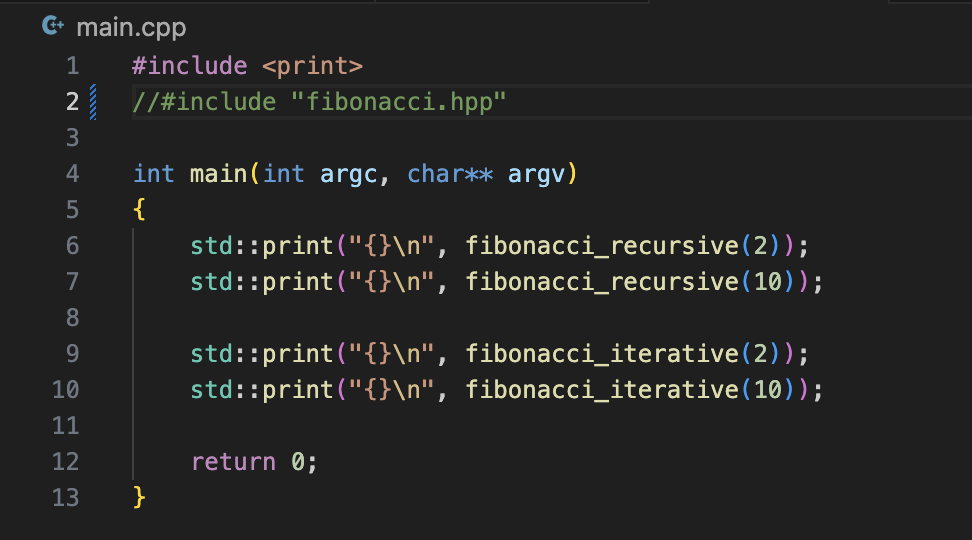
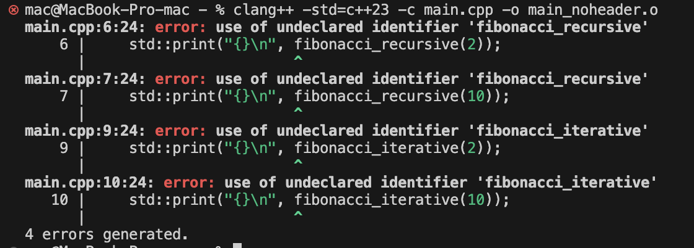
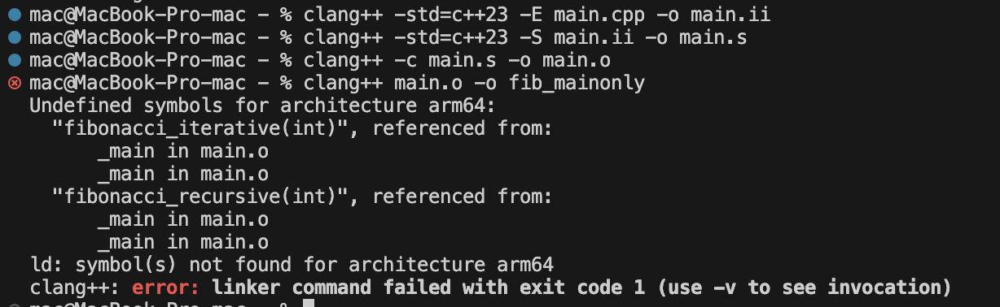

# Assignment 2

## 1. Program organisation:

## 2. Stages exploration:

## 3. Explanation:
### 1. What do the .ii, .s, object, and executable files contain? Which are text files, which are binary files, and which build stage produces each one?
- `.ii` file is in text format, it's the code after preprocessing: all `#include`s are changed to a "lower" perspective, mentioning files and rows from which the actual inclusion is happening. The program won't compile at this stage, compiler doesn't understand it yet. We need to go deeper and put this code into Assembly code, which brings us to `.s` file.
- `.s` file is still readable, it is written in assembly. Still not ready for a run, but is closer to how the computer reads the instructions.
- `.o` file - object file in binary format, which contains machine code + a table of symbols, but still not ready for a run.
- executable file - link stage, where all of this data in `.o` files gets sewn together and determines the actual addresses. Executable file is in binary format.

### 2. Why can main.cpp compile when it sees a function declaration but not the function body? Why does linking still need the definition?
Compiler only needs to know the name of the function, the parameters(quantity + type) and what does the function get in and return. The linker need the definition to understand what does he need to do with those parameters and what does this function do exactly, since executable file cannot have those gaps, that object file has - all needs to be assembled in one. The linker needs to know the actual address cell in memory for this function, because a simple reference to the function is not executable.

### 3. What does the include guard prevent? If both .cpp files include the same header, does the guard stop the second source file from seeing its contents?
It prevents the duplicate insertion of headers. It would not prevent the second file from seeing the contents, since the files compile separately, but it would cause a compile-time error because of duplicate definition.

### 4. Which object files must be rebuilt after changing only a function body in fibonacci.cpp? What changes if you edit a declaration in the shared header?
Since the change appeared only in `fibonacci.cpp`, we don't need to rebuild `main.o`, but `fibonacci.o` needs to be. `main.cpp` doesn't care about the definition, since it simply redirects the data to this function. But if a shared header (in our case it's `fibonacci.hpp`) is changed, of course we need to recompile both `main.o` and `fibonacci.o`, since both translation units depended on header's contents.

## 4. Errors exploration:
### 1. Missing declaration:
The missing information here is the declaration, because of this the compiler does not know where to look to find those functions, since this header `fibonacci.hpp` is the only binding factor for both `main.cpp` and `fibonacci.cpp`, they can't exchange info without the `.hpp` file. This causes compile-time error.

### 2. Missing definition:
The linker is left with only the declarations with the gap in definitions, since we didn't include fibonacci.o to the linking stage, so it cannot resolve the symbols and refuses to produce the executable file.
