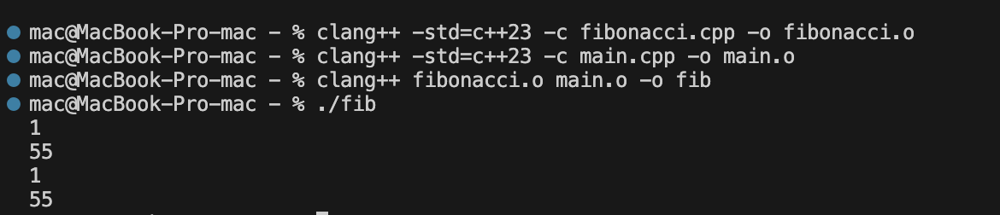
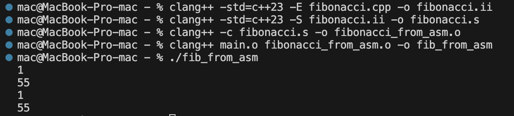
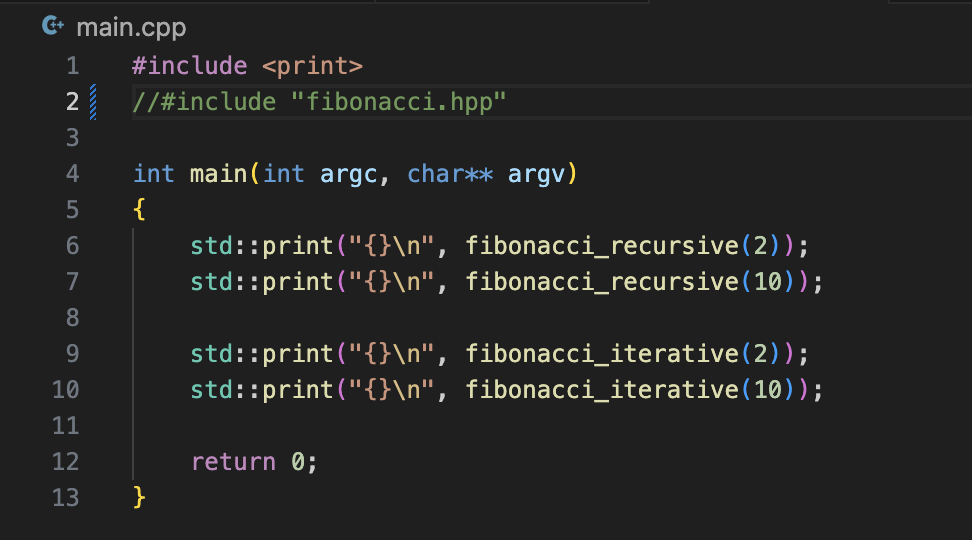
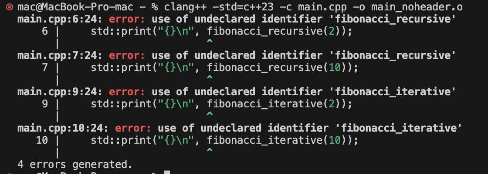
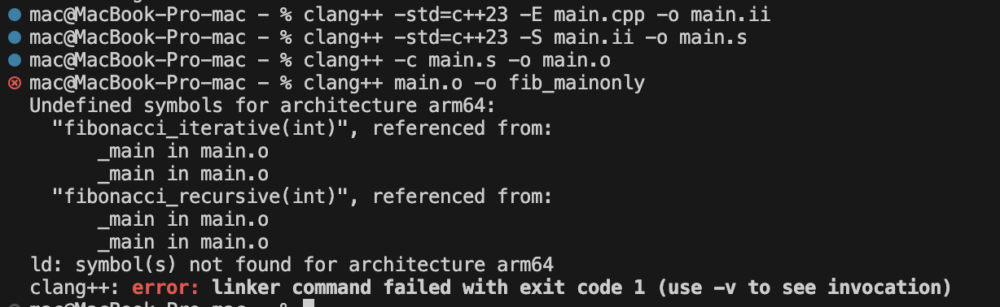
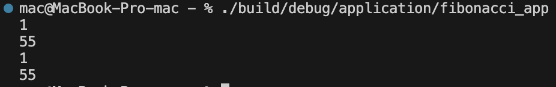
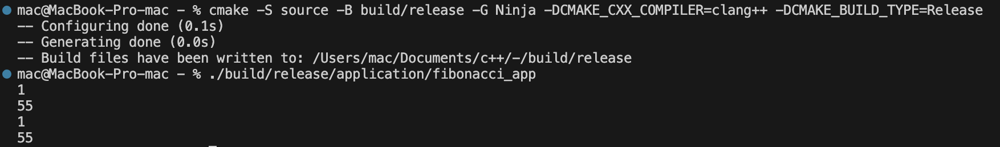

# Assignment 2

## 1. Program organisation:


## 2. Stages exploration:


## 3. Explanation:
### 1. What do the .ii, .s, object, and executable files contain? Which are text files, which are binary files, and which build stage produces each one?
- `.ii` file is in text format, it's the code after preprocessing: all `#include`s are changed to a "lower" perspective, mentioning files and rows from which the actual inclusion is happening. The program won't compile at this stage, compiler doesn't understand it yet. We need to go deeper and put this code into Assembly code, which brings us to `.s` file.
- `.s` file is still readable, it is written in assembly. Still not ready for a run, but is closer to how the computer reads the instructions.
- `.o` file - object file in binary format, which contains machine code + a table of symbols, but still not ready for a run.
- executable file - link stage, where all of this data in `.o` files gets sewn together and determines the actual addresses. Executable file is in binary format.

### 2. Why can main.cpp compile when it sees a function declaration but not the function body? Why does linking still need the definition?
Compiler only needs to know the name of the function, the parameters(quantity + type) and what does the function get in and return. The linker need the definition to understand what does he need to do with those parameters and what does this function do exactly, since executable file cannot have those gaps, that object file has - all needs to be assembled in one. The linker needs to know the actual address cell in memory for this function, because a simple reference to the function is not executable.

### 3. What does the include guard prevent? If both .cpp files include the same header, does the guard stop the second source file from seeing its contents?
It prevents the duplicate insertion of headers. It would not prevent the second file from seeing the contents, since the files compile separately, but it would cause a compile-time error because of duplicate definition.

### 4. Which object files must be rebuilt after changing only a function body in fibonacci.cpp? What changes if you edit a declaration in the shared header?
Since the change appeared only in `fibonacci.cpp`, we don't need to rebuild `main.o`, but `fibonacci.o` needs to be. `main.cpp` doesn't care about the definition, since it simply redirects the data to this function. But if a shared header (in our case it's `fibonacci.hpp`) is changed, of course we need to recompile both `main.o` and `fibonacci.o`, since both translation units depended on header's contents.

## 4. Errors exploration:
### 1. Missing declaration:
The missing information here is the declaration, because of this the compiler does not know where to look to find those functions, since this header `fibonacci.hpp` is the only binding factor for both `main.cpp` and `fibonacci.cpp`, they can't exchange info without the `.hpp` file. This causes compile-time error.




### 2. Missing definition:
The linker is left with only the declarations with the gap in definitions, since we didn't include fibonacci.o to the linking stage, so it cannot resolve the symbols and refuses to produce the executable file.


# Assignment 3

## 1. Why adding a directory does not replace linking a target
`add_subdirectory(dir)` only tells CMake to also process `dir/CMakeLists.txt` and register the targets it defines in the same project. After that, `fibonacci_lib` and `fibonacci_app` simply both *exist* in the build graph - there is still no relationship between them. CMake does not guess that the app uses the library just because they are in the same project.

That relationship is created only by `target_link_libraries(fibonacci_app PRIVATE fibonacci_lib)`. It (1) puts the library on the app's link line, so the linker can resolve `fibonacci_recursive`/`fibonacci_iterative` (without it we would get the same "undefined symbols" link error as in Assignment 2's missing-definition experiment), (2) makes the library build before the app, and (3) propagates the library's PUBLIC usage requirements, such as its include directory, to the app. In short, `add_subdirectory` decides *which targets exist*, linking decides *who depends on whom*.

## 2. C++23 without language extensions
The app is linked to the library by target name: `target_link_libraries(fibonacci_app PRIVATE fibonacci_lib)`. `target_compile_features(<target> PRIVATE cxx_std_23)` tells CMake the target needs at least C++23. By default CMake then passes `-std=gnu++23`, for example, C++23 **plus** GNU compiler extensions. To get pure standard C++ we set the target property `CXX_EXTENSIONS` to `OFF`.

```cmake
set_target_properties(<target> PROPERTIES CXX_EXTENSIONS OFF)
```

## 3. Header search path
The library declares its include directory as a PUBLIC requirement:

```cmake
target_include_directories(fibonacci_lib PUBLIC include)
```

The application has no include setting of its own, it gets `-I.../libraries/fibonacci/include` only because it links to `fibonacci_lib`, which forwards its PUBLIC requirements to whoever links it.

### Why the include path is PUBLIC, but sources and language are PRIVATE
- **PRIVATE** = needed only to build this target. **PUBLIC** = needed to build this target and by anyone who uses it.
- **Include path - PUBLIC.** `fibonacci.hpp` is the library's interface. `fibonacci.cpp` needs it to compile the library, and `main.cpp` needs it to call the functions. So the path is needed on both sides.
- **Sources - PRIVATE.** `fibonacci.cpp` is compiled once into `libfibonacci_lib.a`. The app uses the finished compiled code through linking. If the source were PUBLIC, it would be compiled into the app too and the functions would be defined twice.
- **Language (`cxx_std_23`, no extensions) - PRIVATE.** It controls how this target's `.cpp` files are compiled. The header uses only plain `int` functions, so users of the library don't need C++23. Each target states its own standard, the app sets C++23 in its own `CMakeLists.txt`.

## 4. Debug and Release builds
Each configuration gets its own build directory under `build/`. 
```bash
cmake -S source -B build/debug -G Ninja -DCMAKE_CXX_COMPILER=clang++ -DCMAKE_BUILD_TYPE=Debug
./build/debug/application/fibonacci_app

cmake -S source -B build/release -G Ninja -DCMAKE_CXX_COMPILER=clang++ -DCMAKE_BUILD_TYPE=Release
./build/release/application/fibonacci_app
```




## 5. Diagnosing a missing requirement
In `source/libraries/fibonacci/CMakeLists.txt` I temporarily changed

```cmake
target_include_directories(fibonacci_lib PUBLIC include)
```
to `PRIVATE` and rebuilt Debug with `cmake --build build/debug`:

```
mac@MacBook-Pro-mac - % cmake --build build/debug
[0/1] Re-running CMake...
-- Configuring done (0.1s)
-- Generating done (0.0s)
-- Build files have been written to: /Users/mac/Documents/c++/-/build/debug
[1/3] Building CXX object application/CMakeFiles/fibonacci_app.dir/src/main.cpp.o
FAILED: [code=1] application/CMakeFiles/fibonacci_app.dir/src/main.cpp.o 
/opt/homebrew/opt/llvm@19/bin/clang++   -g -std=c++23 -arch arm64 -MD -MT application/CMakeFiles/fibonacci_app.dir/src/main.cpp.o -MF application/CMakeFiles/fibonacci_app.dir/src/main.cpp.o.d -o application/CMakeFiles/fibonacci_app.dir/src/main.cpp.o -c /Users/mac/Documents/c++/-/source/application/src/main.cpp
/Users/mac/Documents/c++/-/source/application/src/main.cpp:2:10: fatal error: 'fibonacci.hpp' file not found
    2 | #include "fibonacci.hpp"
      |          ^~~~~~~~~~~~~~~
1 error generated.
ninja: build stopped: subcommand failed.
```

### Failing stage
CMake's **configure and generate** steps still succeed, to CMake this is a valid project, it just has fewer requirements. The failure is at compile time, in the preprocessing part of compiling `main.cpp`: the preprocessor cannot find the file named in `#include`, we never reach linking.
Only the app fails: `fibonacci.cpp` was not even rebuilt, because its compile command did not change.

### Why the library still has its include path, but the app does not
**PRIVATE** means "use this only to build the target itself". The `-I` flag stays on `fibonacci_lib`'s own compile commands, so `fibonacci.cpp` still finds its header. `target_link_libraries(fibonacci_app PRIVATE fibonacci_lib)` passes on only the library's **PUBLIC** requirements. There is no longer a public include path, so the app gets nothing and `main.cpp` is compiled with no `-I` flag at all.

### Fix
Restored `PUBLIC`, rebuilt and ran:

```
mac@MacBook-Pro-mac - % cmake --build build/debug       
[0/1] Re-running CMake...
-- Configuring done (0.1s)
-- Generating done (0.0s)
-- Build files have been written to: /Users/mac/Documents/c++/-/build/debug
[2/3] Linking CXX executable application/fibonacci_app
mac@MacBook-Pro-mac - % ./build/debug/application/fibonacci_app                                                          
1
55
1
55
```
